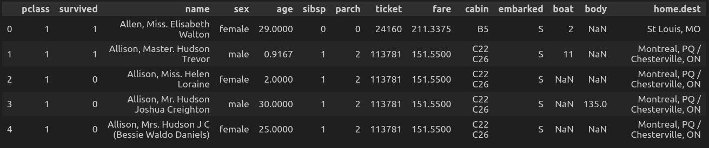

# Exploratory Data Analysis Using the Titanic Dataset

The Titanic dataset originally consisted of 1309 rows and 14 columns, as shown below:

### Dataset Description

- **pclass:** Passenger Class (1 = 1st, 2 = 2nd, 3 = 3rd)
- **survived:** Survival (0 = No, 1 = Yes)
- **name:** Passenger Name
- **sex:** Gender (male/female)
- **age:** Age
- **sibsp:** Number of Siblings/Spouse Aboard
- **parch:** Number of Parents/Children Aboard
- **ticket:** Ticket Number
- **fare:** Fare
- **cabin:** Cabin Number
- **embarked:** Port of Embarkation (C = Cherbourg, Q = Queenstown, S = Southampton)
- **boat:** Lifeboat (if survived)
- **body:** Body Number (if not survived and the body is recovered)
- **home.dest:** Home Destination

## Data Cleaning

The following data cleaning steps were performed:

- **Column Removal:**  
  Removed irrelevant columns for the analysis: `name`, `ticket`, `cabin`, `embarked`, `boat`, `body`, and `home.dest`.

- **Handling Missing Values:**  
  - Filled in missing values in the `age` column with the median age for the respective gender.
  - Filled in missing values in the `fare` column with the mean fare for the respective passenger class.

- **Duplicates:**  
  Checked for and removed duplicate records.

- **Outlier Detection:**  
  Examined the `fare` and `age` columns using box plots.

  

  Although outliers are present in both the `fare` and `age` columns, they have been retained because they represent real-world variations (such as extremely wealthy passengers or very elderly individuals) and may hold meaningful correlations with survival.

- **Feature Engineering:**  
  Combined the `sibsp` and `parch` columns into a single, more informative feature named `is_alone`.

After these cleaning steps, the dataset was reduced to 1100 rows and 6 columns.
